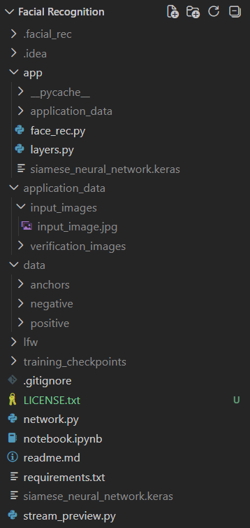

# Facial Recognition with a Convolutional Siamese Network

> An educational face-verification project: collect image pairs, train a shared CNN, and verify a live camera frame against an enrolled image gallery. An attempt at implementing the Siamese Convolutional Network. <br>
> Link to research paper : https://www.cs.cmu.edu/~rsalakhu/papers/oneshot1.pdf

This project answers **"is this the same person?"** It is not a general-purpose face detector, identity classifier, biometric security product, or production-ready authentication system. The model is trained for the faces and image conditions represented in its data, so treat its output as an experiment rather than proof of identity.

## Contents

- [Facial Recognition with a Convolutional Siamese Network](#facial-recognition-with-a-convolutional-siamese-network)
  - [Contents](#contents)
  - [What the project does](#what-the-project-does)
  - [Current project structure](#current-project-structure)
  - [Prerequisites](#prerequisites)
  - [Create and activate the project environment](#create-and-activate-the-project-environment)
  - [Collect anchors and positives](#collect-anchors-and-positives)
    - [Meaning of each group](#meaning-of-each-group)
    - [Use the webcam collector](#use-the-webcam-collector)
    - [Manual collection](#manual-collection)
  - [Download negatives from Kaggle LFW](#download-negatives-from-kaggle-lfw)
  - [Prepare the training data](#prepare-the-training-data)
  - [Train and evaluate the model](#train-and-evaluate-the-model)
  - [Run live verification](#run-live-verification)
    - [Enroll verification images](#enroll-verification-images)
    - [Start the app](#start-the-app)
  - [How the model works](#how-the-model-works)
  - [Troubleshooting](#troubleshooting)
    - [`FileNotFoundError` or the wrong working directory](#filenotfounderror-or-the-wrong-working-directory)
    - [No webcam frame appears](#no-webcam-frame-appears)
    - [The app cannot load the model](#the-app-cannot-load-the-model)
    - [Verification always fails or always succeeds](#verification-always-fails-or-always-succeeds)
    - [TensorFlow reports no GPU](#tensorflow-reports-no-gpu)
  - [Limitations and responsible use](#limitations-and-responsible-use)
  - [License and contribution](#license-and-contribution)

## What the project does

The pipeline has four stages:

1. **Collect anchors:** reference images of the person who will be verified.
2. **Collect positives:** additional images of that same person, with different expressions, lighting, positions, and backgrounds.
3. **Add negatives:** images of other people. This repository uses the Labeled Faces in the Wild (LFW) dataset downloaded from Kaggle.
4. **Train and verify:** the Siamese network compares two images and returns a score between 0 and 1. Higher scores mean "more likely the same person."

The CNN maps each image to an embedding. The model then computes the element-wise absolute difference between the two embeddings and passes that difference through a sigmoid classifier.

## Current project structure

The following schematic reflects the directories currently present in this workspace. `lfw/` contains one directory per LFW identity, while the names shown with `...` represent many additional dataset directories and image files.

```text
Facial Recognition/
|-- .gitignore
|-- requirements.txt
|-- readme.md
|-- network.py
|-- stream_preview.py
|-- notebook.ipynb
|-- siamese_neural_network.keras       # root-level trained model
|-- .facial_rec/                       # local virtual environment
|-- training_checkpoints/              # TensorFlow checkpoint files
|   |-- checkpoint
|   |-- checkpoint-1.data-00000-of-00001
|   |-- checkpoint-1.index
|   |-- ...
|   `-- checkpoint-6.index
|-- data/                              # training data
|   |-- anchors/                       # reference images of the enrolled person
|   |-- positive/                      # same-person training images
|   `-- negative/                      # different-person training images
|-- lfw/                               # Kaggle LFW source, grouped by identity
|   |-- Aaron_Eckhart/
|   |-- Aaron_Guiel/
|   |-- Aaron_Patterson/
|   |-- .../
|   `-- many other identity directories/
|-- application_data/                  # root-level workspace data directory
|   |-- input_images/
|   `-- verification_images/
`-- app/                               # Kivy live-verification application
    |-- face_rec.py
    |-- layers.py                      # custom L1 distance layer for loading the model
    |-- siamese_neural_network.keras   # model used by the app
    |-- application_data/
    |   |-- input_images/              # camera capture written at verification time
    |   `-- verification_images/       # enrollment gallery compared with the capture
    `-- __pycache__/                   # generated Python cache
```
<br>
This is how it looks on my end :

  
<br>

The `.gitignore` intentionally excludes datasets, checkpoints, virtual environments, and Keras model files. Keep personal face images and trained models out of source control unless you have an explicit reason and the required consent.

## Prerequisites

- Windows with Python 3.10 or 3.11 recommended.
- A working webcam for `stream_preview.py` and the Kivy application.
- Enough disk space for the Kaggle LFW download and extracted images.
- A Kaggle account and permission to download the selected LFW dataset.
- The repository opened at `D:\Facial Recognition`, or another location after updating the hard-coded paths described in [Troubleshooting](#troubleshooting).

The pinned packages are listed in `requirements.txt`:

```text
tensorflow==2.21.0
keras==3.15.0
numpy==2.5.1
opencv-python==5.0.0.93
matplotlib==3.11.1
Kivy==2.3.1
ipykernel==7.3.0
```

Native Windows TensorFlow generally runs on the CPU for modern TensorFlow releases. GPU output is optional; the notebook already prints the GPUs TensorFlow can see.

## Create and activate the project environment

Open PowerShell in the repository root:

```powershell
cd "D:\Facial Recognition"
py -3.11 -m venv .facial_rec
Set-ExecutionPolicy -Scope Process -ExecutionPolicy RemoteSigned
.\.facial_rec\Scripts\Activate.ps1
python -m pip install --upgrade pip
pip install -r requirements.txt
```

Check that the environment and TensorFlow import correctly:

```powershell
python -c "import tensorflow as tf; print(tf.__version__); print(tf.config.list_physical_devices())"
```

To use the notebook, select `.facial_rec` as the Python/Jupyter kernel in VS Code and open `notebook.ipynb`.

## Collect anchors and positives

### Meaning of each group

| Directory | Contents | Pair label |
| --- | --- | --- |
| `data/anchors` | Reference images of the person to verify | Used as the first image in pairs |
| `data/positive` | More images of that same person | `1`, same person |
| `data/negative` | Images of other people | `0`, different person |

An anchor and a positive should show the same person, but they should not be identical copies. Collect varied examples: front-facing and slight angles, neutral and smiling expressions, glasses/no glasses if relevant, and several lighting conditions. Keep the face visible and reasonably centered. Avoid using frames with multiple faces unless the face-cropping logic has been updated.

### Use the webcam collector

From the repository root, run:

```powershell
python stream_preview.py
```

The preview window uses these keys:

| Key | Action |
| --- | --- |
| `a` | Save the current frame to `data/anchors` |
| `p` | Save the current frame to `data/positive` |
| `q` | Quit and release the webcam |

The script creates the three directories automatically and names images with UUIDs. Capture enough images for the intended experiment; a small demo may use a few hundred anchors and positives, but performance depends more on variety and image quality than on a magic count.

### Manual collection

You can also place `.jpg`, `.jpeg`, or `.png` files directly into the directories. The notebook currently discovers `.jpg` files with Windows-style path patterns, so convert other formats or update the notebook's file pattern before training.

## Download negatives from Kaggle LFW

LFW is organized as `lfw/<person-name>/<image>.jpg`. Those images are useful negatives because they depict people other than the enrolled subject.

1. Sign in to Kaggle and download an LFW dataset. The extracted folder must contain identity directories such as `Aaron_Eckhart`, `Aaron_Guiel`, and `Aaron_Patterson`.
2. Extract the dataset into the repository so the source path is:

   ```text
   D:\Facial Recognition\lfw\<identity>\<image>.jpg
   ```

3. Confirm that `lfw` contains directories, not an extra nested directory such as `lfw\lfw\...`.
4. Copy the files into `data/negative` while preserving unique names. The safest approach is this PowerShell command:

   ```powershell
   Get-ChildItem .\lfw -Recurse -File -Include *.jpg,*.jpeg,*.png | ForEach-Object {
       Copy-Item $_.FullName (Join-Path .\data\negative $_.Name)
   }
   ```

   If two source folders contain the same filename, copy them with unique names first. Do not use `Move-Item` unless you intentionally want to destroy the grouped `lfw` copy.

The notebook contains an older `os.replace` migration cell that **moves** each file out of `lfw` and flattens it into `data/negative`. Running that cell changes the downloaded dataset and may collide on duplicate filenames. Prefer the copy command above, or replace that notebook cell with a collision-safe copy routine before running it.

## Prepare the training data

The notebook is the training entry point. Its data preparation flow is:

1. Create `data/anchors`, `data/positive`, and `data/negative`.
2. Load up to 300 `.jpg` paths from each training group.
3. Resize images to `100 x 100` pixels and normalize RGB values to the `[0, 1]` range.
4. Build positive pairs: `(anchor, positive, 1)`.
5. Build negative pairs: `(anchor, negative, 0)`.
6. Shuffle, batch, and split the pair dataset into training and test data.

Run the notebook cells in order. Do not skip the preprocessing and dataset-construction cells: the saved model expects two images shaped `(100, 100, 3)` with normalized pixel values.

Before training, verify that the directories are populated:

```powershell
Get-ChildItem .\data\anchors -File | Measure-Object
Get-ChildItem .\data\positive -File | Measure-Object
Get-ChildItem .\data\negative -File | Measure-Object
```

Use separate images for a meaningful test set. If nearly identical images from the same recording appear in both training and test pairs, reported metrics can be misleadingly high.

## Train and evaluate the model

In `notebook.ipynb`, the current training implementation uses:

- Binary cross-entropy loss.
- `AdamW` with a learning rate of `1e-4`.
- A custom `tf.GradientTape` training step.
- 50 epochs in the recorded run.
- Checkpoints saved in `training_checkpoints` every 10 epochs.
- A final model saved as `siamese_neural_network.keras`.

Feel free to play around with the hyperparameters and stuff to make this model better, please reach out if you want to discuss or find better ways to arrange the network.
The notebook also evaluates predictions at a 0.5 pair-classification threshold and calculates accuracy, precision, recall, F1 score, and a confusion matrix. Re-run evaluation on a test set that was not used to fit the model; do not treat training loss alone as evidence of reliable verification.

The model can be inspected from the command line:

```powershell
python network.py
```

That command builds the architecture and prints its summary. It does not train the model.

After training, keep the model used by the app synchronized:

```powershell
Copy-Item .\siamese_neural_network.keras .\app\siamese_neural_network.keras -Force
```

## Run live verification

The Kivy app compares one camera capture with every image in `app/application_data/verification_images`.

### Enroll verification images

Copy several clear images of the person to verify into:

```text
app/application_data/verification_images/
```

These are not automatically read from `data/anchors`. For a simple enrollment, copy the anchor images:

```powershell
Copy-Item .\data\anchors\*.jpg .\app\application_data\verification_images\ -Force
```

Use only images of the intended person in this gallery. The app divides the number of detections by the number of gallery files, so an empty gallery causes a division-by-zero failure and a mixed gallery changes the verification meaning.

### Start the app

From the `app` directory:

```powershell
cd app
python face_rec.py
```

Press **Verify**. The app saves the current cropped camera frame as `app/application_data/input_images/input_image.jpg`, compares it with each gallery image, and displays `Verified!` when more than half of the gallery comparisons exceed the detection threshold of `0.99`.

The application currently crops the camera frame using fixed coordinates (`y=120..370`, `x=200..450`). If your webcam resolution or face position differs, the crop may miss the face; adjust the crop or add a face detector before relying on the result. The camera index is `0`; try another index if the wrong camera opens.

## How the model works

`network.py` defines a shared embedding network with four convolutional blocks, max pooling, flattening, and a 4096-unit sigmoid dense layer. The same network processes both inputs, which encourages both images to be represented in the same feature space.

For images $x_1$ and $x_2$, the comparison is:

$$
d = |f(x_1) - f(x_2)|
$$

where $f$ is the shared CNN embedding function. A final dense sigmoid layer maps $d$ to a similarity score. The custom `L1Distance` layer must be registered when loading the root model, and the app's `layers.py` supplies the compatible `L1_distance` implementation.

## Troubleshooting

### `FileNotFoundError` or the wrong working directory

`stream_preview.py` and `app/face_rec.py` contain absolute `os.chdir` calls targeting `D:/Facial Recognition` and `D:/Facial Recognition/app`. Run them from this repository location, or update those paths to use `pathlib.Path(__file__).resolve()` before moving the project.

### No webcam frame appears

Close other camera applications, check Windows camera permissions, and try changing `cv2.VideoCapture(0)` to another index such as `1`. Confirm that `ret` is `True` before saving frames.

### The app cannot load the model

Run the app from `app/`, confirm that `app/siamese_neural_network.keras` exists, and keep the custom layer name compatible with `layers.py`. If you trained a new root model, copy it into `app/` as shown above.

### Verification always fails or always succeeds

Check that the gallery is non-empty, all gallery files show the same enrolled person, and the camera crop contains a face. The thresholds in `face_rec.py` are strict (`0.99` per image and a 50% gallery vote); tune them only against a held-out validation set and record the resulting false-accept and false-reject rates.

### TensorFlow reports no GPU

That is expected for many native Windows TensorFlow installations. Training still works on CPU, although it may be slow. Use a supported Linux/WSL2 or DirectML setup only after checking the TensorFlow and hardware compatibility requirements.

## Limitations and responsible use

- Obtain informed consent before collecting or storing anyone's face images.
- Face images and model files are sensitive biometric-related data; protect them and avoid committing them to a public repository.
- The project has no liveness detection, anti-spoofing, access control, encryption, audit log, or calibrated probability output.
- Lighting, pose, camera quality, cropping, demographic imbalance, and dataset bias can change results substantially.
- Never use this demo as the sole basis for access decisions, employment decisions, law-enforcement decisions, or other high-impact decisions.
- Evaluate false accepts and false rejects on data representative of the actual environment before drawing conclusions.

## License and contribution

                    GNU GENERAL PUBLIC LICENSE
                       Version 3, 29 June 2007

 Copyright (C) 2007 Free Software Foundation, Inc. <https://fsf.org/>
 Everyone is permitted to copy and distribute verbatim copies
 of this license document, but changing it is not allowed.